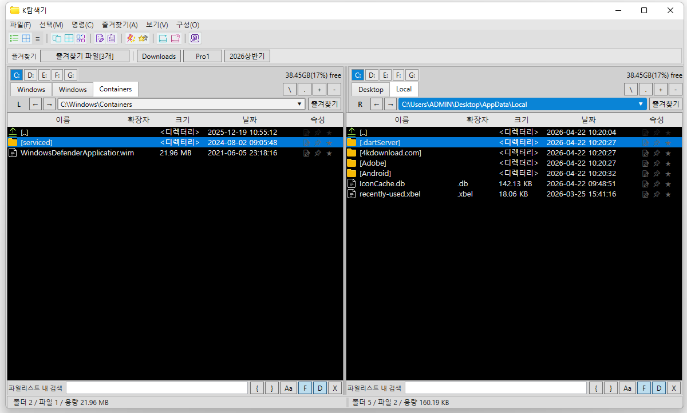
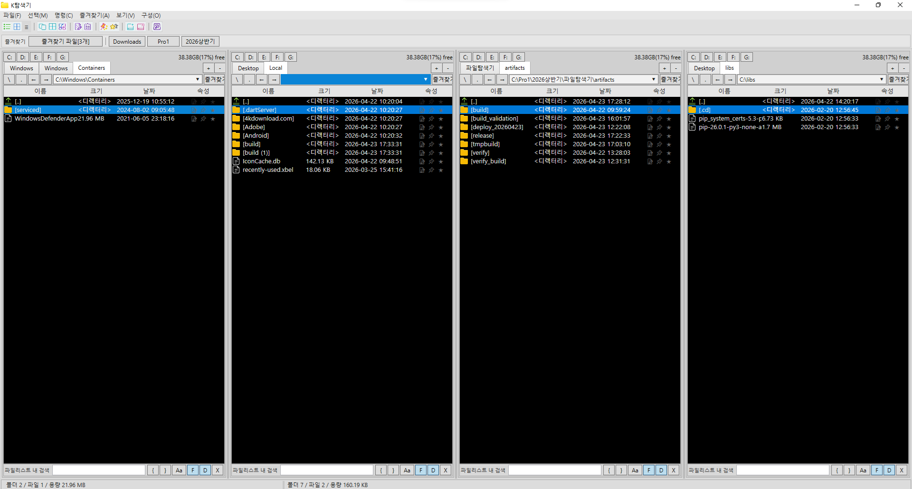
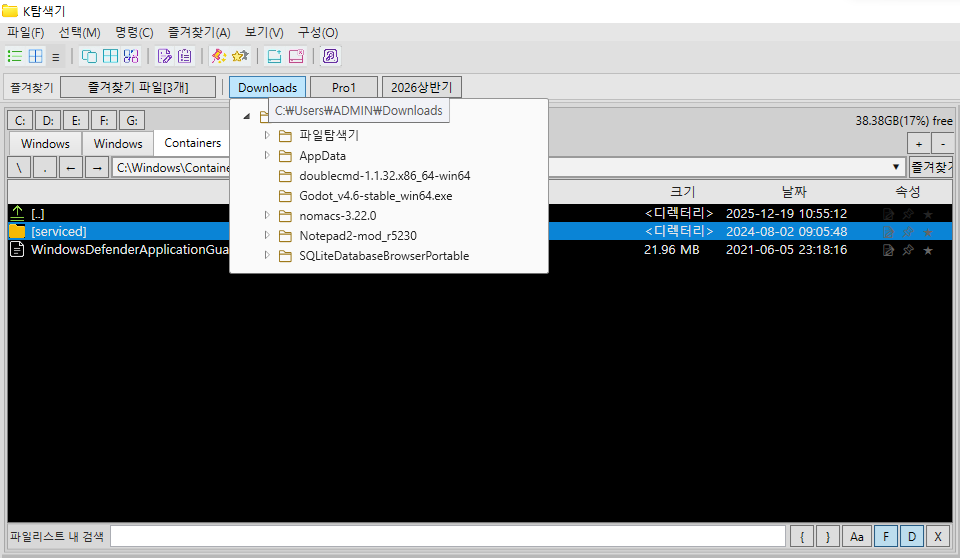
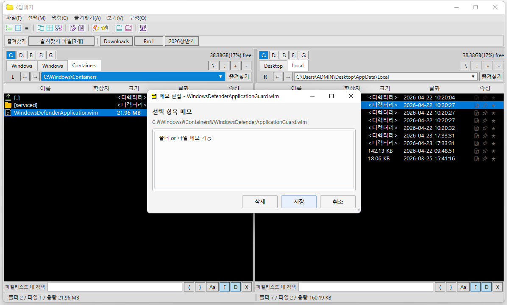
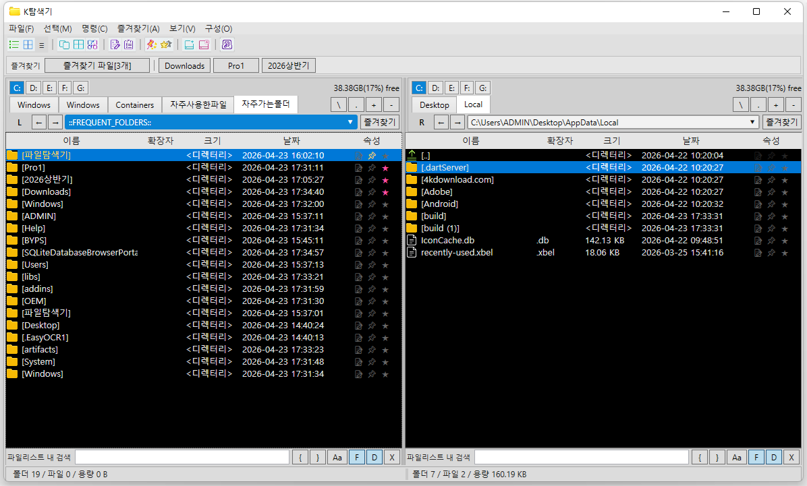

# K-Explorer

Windows용 업무형 파일 탐색기입니다. 빠른 키보드 중심 탐색 경험에, 즐겨찾기/핀/메모/검색/2패널·4패널 전환 기능을 결합했습니다.

## 주요 기능
- 2패널/4패널 모드 전환
- 탭 기반 탐색 + 뒤로/앞으로 히스토리
- 즐겨찾기 폴더/파일, 핀 고정
- 메모 목록/자주가는폴더/자주사용한파일 가상 경로
- 빠른 검색 및 결과에서 포함 폴더 열기
- 복사/이동/삭제/이름변경/F키 단축키 중심 작업

## 스크린샷
> 아래 이미지는 최신 UI로 계속 갱신됩니다.

| 화면 1 | 화면 2 |
| --- | --- |
|  |  |
|  |  |
|  |  |

## 다운로드
- 최신 릴리즈: `https://github.com/wookoon2024/K-Explorer/releases/latest`
- [빠른다운로드 (zip)](https://raw.githubusercontent.com/wookoon2024/K-Explorer/main/dist/K-Explorer-win-x64.zip)
- 배포 파일: `K-Explorer-win-x64.zip`
- 최종 배포일: `2026-04-24`

## 버전 히스토리
- [v1.2.0 릴리즈 노트](RELEASE_NOTES_v1.2.0.md)
- [v1.1.0 릴리즈 노트](RELEASE_NOTES_v1.1.0.md)
- [v1.0.0 릴리즈 노트](RELEASE_NOTES_v1.0.0.md)

## 실행 방법
1. 릴리즈에서 `K-Explorer-win-x64.zip` 다운로드
2. 압축 해제
3. `K-Explorer.exe` 실행

## 개발 환경
- .NET 8
- WPF (MVVM)
- C#

## 빌드
```powershell
dotnet build WorkFileExplorer.sln -c Release
```

## 퍼블리시
```powershell
dotnet publish WorkFileExplorer.App\WorkFileExplorer.App.csproj -c Release -r win-x64 --self-contained false -o artifacts\deploy_20260423\WorkFileExplorer
```

## 라이선스
사내/개인 프로젝트 정책에 맞는 라이선스를 선택해 추가하세요.
