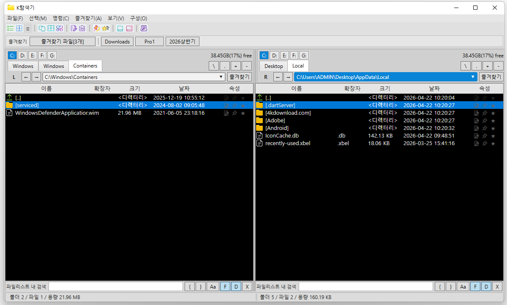
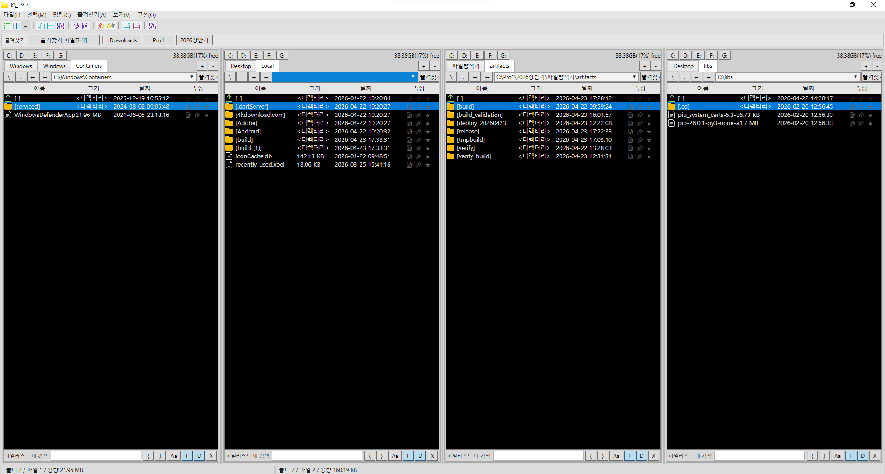
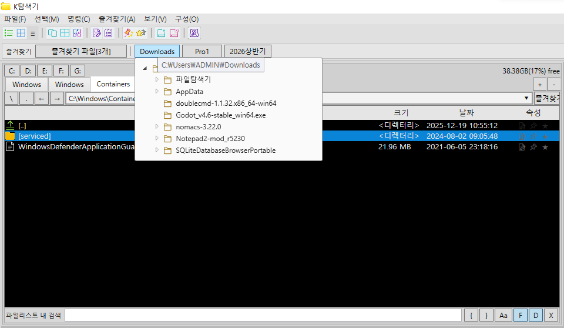
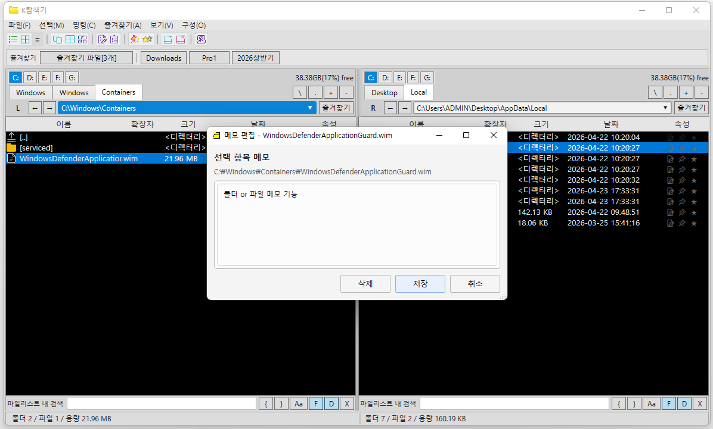
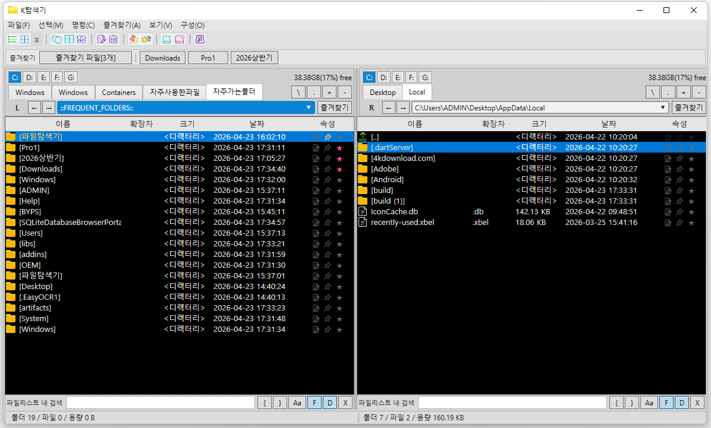

# K-Explorer

Windows용 업무형 파일 탐색기입니다. 빠른 키보드 중심 탐색 경험에, 즐겨찾기/핀/메모/검색/2패널·4패널 전환 기능을 결합했습니다.

## 주요 기능
- 2패널/4패널 모드 전환
- 탭 기반 탐색 + 뒤로/앞으로 히스토리
- 즐겨찾기 폴더/파일, 핀 고정
- 메모 목록/자주가는폴더/자주사용한파일 가상 경로
- 빠른 검색 및 결과에서 포함 폴더 열기
- 복사/이동/삭제/이름변경/F키 단축키 중심 작업
- Shift + 방향키 다중 범위 선택 지원
- 파일 복사/이동/삭제 시 "모두 취소" 기능 지원
- 숨김/시스템 파일·폴더 표시 여부 설정
- 패널 간 키보드 포커스 간섭(Drift) 차단

## 스크린샷
> 아래 이미지는 최신 UI로 계속 갱신됩니다.

| 화면 1 | 화면 2 |
| --- | --- |
|  |  |
|  |  |
|  |  |

## 다운로드
- 최신 릴리즈: `https://github.com/wookoon2024/K-Explorer/releases/latest`
- 최신 버전: `v1.3.15`
- 최신 버전 링크: `https://github.com/wookoon2024/K-Explorer/releases/tag/v1.3.15`
- 최신 파일 다운로드 (zip): `https://raw.githubusercontent.com/wookoon2024/K-Explorer/main/K-Explorer-win-x64-v1.3.15.zip`
- [빠른다운로드 (zip)](https://raw.githubusercontent.com/wookoon2024/K-Explorer/main/K-Explorer-win-x64-v1.3.15.zip)
- 배포 파일: `K-Explorer-win-x64-v1.3.15.zip`
- 최종 배포일: `2026-07-21`

## 버전 히스토리
- [v1.3.15 릴리즈 노트](RELEASE_NOTES_v1.3.15.md)

이전 버전의 릴리즈 노트는 저장소 커밋 기록에서 확인할 수 있습니다.

## 실행 방법
1. 위 [빠른다운로드](#다운로드)에서 `K-Explorer-win-x64-v1.3.15.zip` 다운로드
2. 압축 해제
3. `K-Explorer.exe` 실행

> .NET 8 데스크톱 런타임이 설치돼 있어야 합니다.

## 개발 환경
- .NET 8
- WPF (MVVM)
- C#

## 빌드
```powershell
dotnet build WorkFileExplorer.sln -c Release
```

## 퍼블리시
```powershell
dotnet publish WorkFileExplorer.App\WorkFileExplorer.App.csproj -c Release -r win-x64 --self-contained false -o artifacts\publish\WorkFileExplorer
```

## 라이선스
개인 프로젝트로, 별도의 라이선스를 정하지 않았습니다. 모든 권리는 저작자에게 있습니다.
